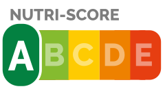

# Open Food Facts

[Open Food Facts](https://world.openfoodfacts.org/) is a collaborative, free and open database of food products from around the world.

## Open Food Facts (the Nova 1 graded)




This project is experimental and is simply listing products from the Open Food Facts free data source. Only items under the **NOVA 1** and **Nutrition Score A** grades are selected.

### Technology

MERN Stack


### Sample data

Download the CSV from [here](https://world.openfoodfacts.org/cgi/search.pl?action=process&tagtype_0=nova_groups&tag_contains_0=contains&tag_0=1&tagtype_1=nutrition_grades&tag_contains_1=contains&tag_1=A&tagtype_2=categories&tag_contains_2=does_not_contain&tag_2=eaux&sort_by=unique_scans_n&page_size=20&axis_x=energy&axis_y=products_n&action=display) and import the sample data into MongoDB:

```bash
mongoimport --db openfood --collection products --type tsv --file openfoodfacts_search.csv --headerline
```

### Development

```bash
npm install
cp .env-sample .env
npm run start:dev
```

#### TODO

- [x] Build an infinite scroll
- [ ] Create indexes on the DB
- [x] Display a Dialog
- [ ] Display a Drawer
- [ ] Refine the search method
- [ ] Add a favorite function using the localStorage
- [ ] Write a more generic import script
- [ ] Deploy on Heroku
- [ ] Break into components (w/ Context API)
